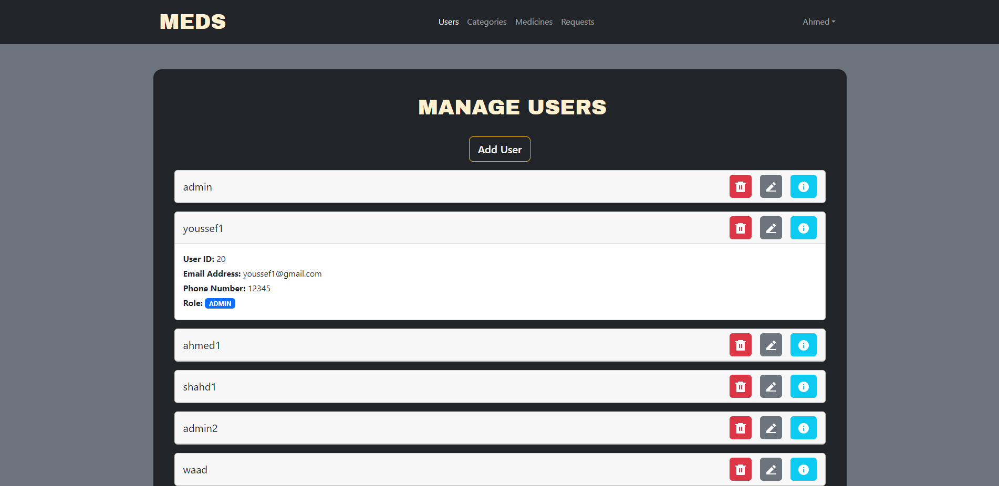

# Meds Dashboard

Internet Applications University Course Project

## Requirements

* Admin and Patient must first log into the "Meds" dashboard
* Admin can manage the medicines( add, update, delete, and list).
* Admin can manage categories of medicines( add, update, delete, and list).
* Admin can manage patients( add, update, delete, and list).
* Patient can view, filter, and request medicines.
* Patient can show the requested medicines.

## Screenshots

### Manage Users

<<<<<<< HEAD

### Manage Categories

### Manage Medicines

### Manage Requests

=======

>>>>>>> 0786a413bd3bdcf280f20f6a913ca0d213ff2773
